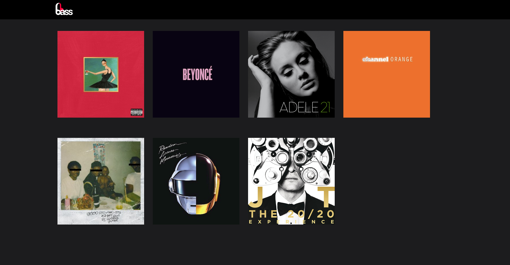

# Bass-Music

## Table of Contents
  <br />

* [About the Project](#about-the-project)
* [Built With](#built-with)
* [Contributing](#contributing)
* [Contact](#authors)

#
<br />

[](https://forthebadge.com) </br>


<br />

#


<!-- ABOUT THE PROJECT   -->
## About The Project

The Bass - Music page sets up a simple page built with rails. This porject contains some samples of artis, albums and songs. You may clone this project and replace with your own artis, covers, songs and albums.

## Screenshot Test
#
<p align="center">
  
</p>

## Contributing

Contributions make the open-source community such an amazing place to learn, inspire, and create. Any contributions you make are **greatly appreciated**.

## Prequisites

Ruby & Rails installed on your local machine.
bundle installed on your machine
Terminal or similar to execute the program.


## Getting Started


## Clone project

- To get a local copy up and running follow these simple example steps.
- Clone this repository with git clone ```https://github.com/sergiocortessat/Rails-Bass-Music``` using your terminal or command line.
- Change to the project directory by entering: ```cd Rails-Bass-Music ``` in the terminal.


## How to use the Bass-Music app
1. run the command ```bundle install```   This will install the required dependencies
2. run the command ```rails webpacker:install ``` This will install the webpack to avoid specific rails 6 problems
3. run the command ```rails db:create``` This will initialize the necessary migration files
4. run the command ```rails db:migrate``` 
5. run the command ```rails server```


## Authors

👤 Sergio Cortes Satizabal

- Github: [@sergiocortessat](https://github.com/sergiocortessat)
- Twitter: [@sergiocortessat](https://twitter.com/sergiocortessat)
- LinkedIn: [@sergiocortessat](www.linkedin.com/in/sergio-cortes-satizabal-3b452194)


### Built With

* [RUBY]
* [RAILS]


<!-- ACKNOWLEDGEMENTS -->

## 📝 License

This project is [MIT](https://github.com/sergiocortessat/sergiocortessat/blob/main/LICENSE) licensed.


